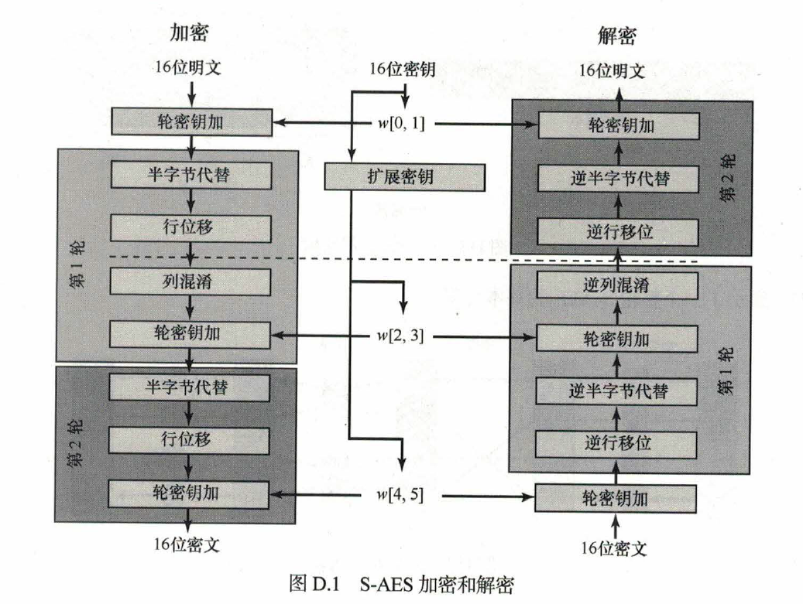

# SAES Encryption Algorithm

一个基于AES简化的加密算法实现，配备有Flask框架的UI。

## 目录

- [项目介绍](#项目介绍)
- [项目功能](#项目功能)
- [SAES算法加密流程](#SAES算法加密流程)
- [技术栈](#技术栈)
- [目录结构](#目录结构)
- [快速开始](#快速开始)
- [联系方式](#联系方式)

## 项目介绍

**SAES** 是一个简化版的AES加密算法，它保留了AES的核心操作，同时提供了基本的加解密功能。为了增强其可用性，本项目还配备了一个基于Flask框架的用户界面。

## 项目功能

- 支持SAES算法的加解密
- 提供图形用户界面进行交互
- 支持对ASCII字符串进行加解密
- 支持二重三重加密
- 支持二重加密的破解
- 长明文CBC模式加解密

## SAES算法加密流程



- 加密公式：

  $A_{K_2} \circ \mathrm{SR} \circ \mathrm{NS} \circ A_{K_1} \circ \mathrm{MC} \circ \mathrm{SR} \circ \mathrm{NS} \circ A_{K_0}$

- 解密公式：

  $A_{K_0} \circ \mathrm{INS} \circ \mathrm{ISR} \circ \mathrm{IMC} \circ A_{K_1} \circ \mathrm{INS} \circ \mathrm{ISR} \circ A_{K_2}$

## 技术栈

- **SAES** - 简化的AES加密算法。
- **Flask** - 用于构建用户界面。

## 目录结构

```
.
├── app.py       # Flask应用启动脚本
├── templates   
│   ├──index.html # 前端页面
├── static
│   ├── css   
│   ├── js
├── SAES.py      # SAES算法实现
├── README.md    
├── requirements.txt   # 项目所需库
├── 用户指南.pdf   # 用户指南
├── 接口文档.pdf   # 开发手册
├── 通关测试情况.pdf    # 测试结果
```

## 快速开始

1. 克隆或下载项目到本地。
```
git clone https://github.com/HJingCheng/S-AES.git
```

2. 安装所需的依赖：
```bash
pip install -r requirements.txt
```
3. 运行Flask应用：
```bash
python app.py
```
4. 打开浏览器并访问`http://localhost:5000`，开始使用!

>测试通关情况请参考**通关情况测试.pdf**
>
>具体使用请参考**用户指南.pdf**
>
>进一步开发请参考**接口文档.pdf**

## 联系方式

如有任何问题或建议，请随时联系我们: [3099626337@qq.com](mailto:3099626337@qq.com)。
